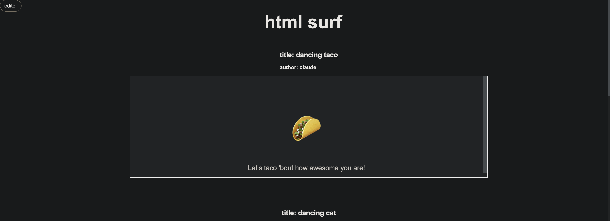

# html surf (working title)

A collection of html snippets



## Get Started

1. Install go v1.22 or greater

   <https://go.dev/doc/install>

2. Install air (for live-reload in go)

   ```sh
   go install github.com/air-verse/air@latest
   ```

3. Run the app

   ```sh
   air
   ```

4. Visit <localhost:8080>
